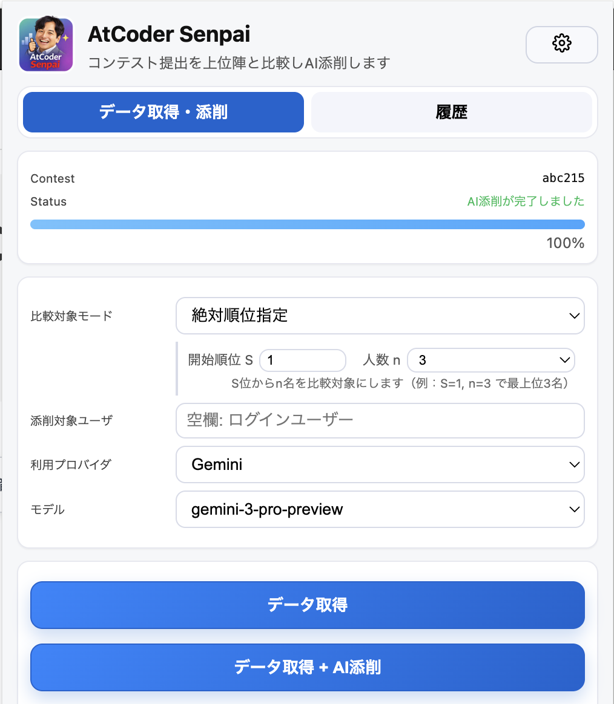

# AtCoder Senpai

AtCoder Senpai は、指定したユーザーの提出と上位陣の提出の「差分」をAIに添削させるのに便利な Chrome 拡張です。
コンテストページで拡張を開きワンクリックするだけで、提出データの収集からレポート生成まで完了します。ABC / ARC / AGC などのアルゴリズム系に加え、AHCにも対応しており、プロンプトはそれぞれ個別にカスタマイズ可能です。

方針レベルの違いから実装上の工夫まで、問題ごとに具体的な比較・解説ができます。一般的なプログラミングプラクティスではなく、競プロ上位勢のコードを基準にした指摘が得られる点が特徴です。提出時刻などのメタ情報も利用できるため、時間配分や進行のクセまで踏み込んだ分析にも向いています。

AI添削は ChatGPT / Gemini / Claude のAPIキーを設定することで可能になりますが、キーを設定しない場合でも、本拡張で収集したデータを自分のチャット環境に貼り付けて利用できます。

上位陣の提出を見て学ぶ精進方法は、AtCoder のコンテストマネージャである rng_58 さんもオススメする方法です：https://info.atcoder.jp/entry/2025/12/03/170000

AtCoder Senpai を活用して、効率的に、精進を進めましょう！

## レポートサンプル
添削レポートのサンプルです。

- [アルゴリズム系(ABC215)](./sample_reports/atcoder-abc215-kakira-review.html)
- [マラソン系(AHC002)](./sample_reports/atcoder-ahc002-kakira-review.html)

## 主な機能
- コンテスト関連データの取得機能
- 取得したデータを基にAIに添削を依頼する機能
- 取得したデータの管理機能
- APIキー、プロンプトなどのオプション設定

## インストール
Chrome 拡張ストア(予定)でインストールできます。

または：

1. Chrome で `chrome://extensions` を開く
2. 右上「デベロッパーモード」をON
3. 「パッケージ化されていない拡張機能を読み込む」→ このフォルダを選択

## 使い方

### データ収集・添削
1. AtCoder の対象コンテストページ（例: https://atcoder.jp/contests/abc123 ）を開く
2. 拡張アイコンをクリックします。
3. 「データ取得」または「データ取得+AI添削」を押します（「データ取得+AI添削」を行う場合は、事前にAPIキーの設定が必要になります）
4. 結果を確認します
  - 「データ取得」を実行した場合は、AIへのプロンプトが表示されるので、それを任意のAIのチャットに投げてください。レポートが得られます。
  - 「データ取得+AI添削」を実行した場合は、レポートが表示されます。「別タブで開く」ボタンでブラウザの画面をフルに使ってレポートを確認できます。

### 履歴管理
「履歴」タブから、収集したデータの履歴を確認できます。収集したデータのエクスポートや削除も行えます。

### オプション
「データ取得・添削」タブの右上の歯車のアイコンをクリックすると、オプション画面へ飛べます。

- API キー設定 (AI添削を本拡張内で実行する場合は必須)
- プロンプト設定 (アルゴリズム系 / マラソン系)

が設定可能です。

## 注意

- 本拡張は [@kakira9618](https://x.com/kakira9618) が制作しました。非公式のものであることを承知ください。
- AtCoder Senpai のアイコンは [@chokudai](https://x.com/chokudai)さんの[フリー素材](https://www.dropbox.com/scl/fo/xhlo4lgqgp708y6wd7p0d/AHhx65CFaQGBOLBjzK4HzEw?rlkey=wo0fnwy57cbiqcahd6hy3kt5f&dl=0)を基に制作しています。また、拡張のアイコン利用について、許諾を本人にいただいています。
- データ取得はAtCoderに負荷をかけない範囲で行ってください（本拡張はレート制限あり）。
- 他者の提出コードの著作権は提出者に帰属します。配布・公開は避け、個人分析に限定してください。
- コンテスト中の生成AI利用等はAtCoderのルールに従ってください。

